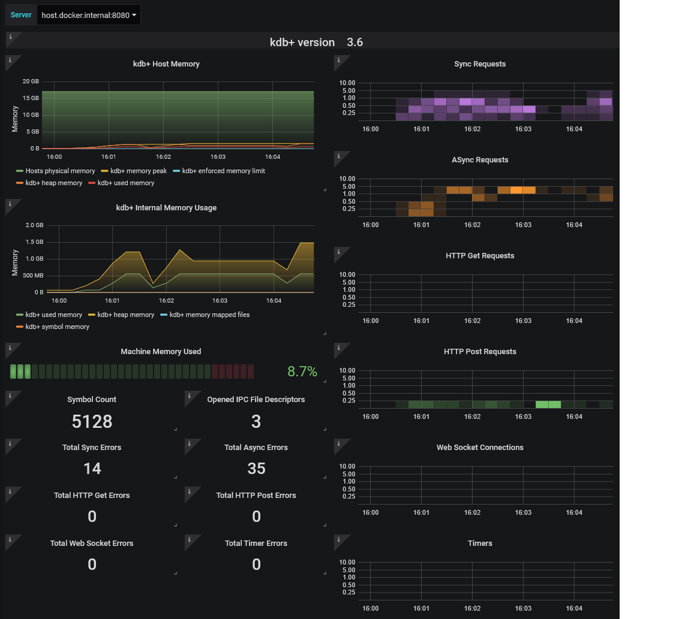

# Prometheus Exporter for kdb+

[](https://github.com/kxsystems/prometheus-kdb-exporter/releases)

## Introduction

This interface provides a method by which to expose metrics from a kdb+ process or multiple processes to Prometheus for monitoring. This is done via the script `exporter.q` which exposes kdb+ process metrics which can be consumed by Prometheus.

This interface is part of the [_Fusion for kdb+_](https://code.kx.com/v2/interfaces/fusion/) project.

## New to kdb+ ?

Kdb+ is the world's fastest time-series database, optimized for ingesting, analyzing and storing massive amounts of structured data. To get started with kdb+, please visit https://code.kx.com/q/learn/ for downloads and developer information. For general information, visit https://kx.com/

## What is Prometheus ?

Prometheus is an open source monitoring solution which facilitates metrics gathering, querying and alerting for a wealth of different 3rd party languages and applications. It also provides integration with Kubernetes for automatic discovery of supported applications.

Visualization and querying can be done through the Prometheus built in expression browser, or more commonly via Grafana. An example of this using docker is provided with this interface.

## Quick Start

Run kdb+ with the supplied q script. This script will expose metrics on port 8080 which can be monitored by Prometheus

```
q exporter.q -p 8080
```

Once running, you can use your web browser to view the currently exposed statistics on the metrics URL e.g. http://localhost:8080/metrics. The metrics exposed will be the metric values at the time at which the URL is requested.

## Example

The demonstration provided with this interface is outlined in full [here](https://code.kx.com/q/interfaces/prom/exporter/examples). For the purposes of this document the following is a summary.

### Requirements
This demonstration requires a Docker instance capable of running a Unix based container e.g. Docker Desktop for Mac/Linux/Windows 19 Pro with internet access

### Setup

Start a q session locally on port 8080, running `exporter.q` via the command

```
q exporter.q -p 8080
```

Initialize and stop the docker environment containing a pre-configured Prometheus and Grafana setup from the `DockerCompose` folder via

**Windows/MacOS**

Initialize the docker instance

```
docker-compose up
```

When finished running the demonstration stop the process using `ctrl-c` or run

```
docker-compose down
```

**Linux**

Initialize the docker instance

```
docker-compose -f docker-compose-linux.yml up
```

Run the following when the environment is to be stopped

```
docker-compose -f docker-compose-linux.yml down
```

### Example resource Utilization

Provided with the interface is the script `kdb_user_example.q`. This can be used to show an example of resources being consumed and monitored using Prometheus. The script will connect to the q session running on port 8080 as outlined about and attempt to use resources in a number of ways

```
q kdb_user_example.q
```

### Accessing Prometheus and Grafana

Once the docker instance has been initialised Prometheus and Grafana should be running on the following ports

- Prometheus = http://localhost:9090
- Grafana = http://localhost:3000

On the Prometheus front end you can monitor specific metrics as desired. Executing `up` for example will allow a user to check that the exporter is 'up'. If the demo is running correctly this will be '1' for your configured kdb+ instance.

To log into Grafana on port 3000 use the following credentials

- Username = admin
- Password = pass

Once logged in a pre-configured dashboard named kdb+ should be available from the `Home` dropdown. This will give an example of monitoring which can be be completed using the interface but is by no means exhaustive

The following is an example of a generated dashboard from the above workflow



## Unsupported Functionality

* This interface does not provide service discovery. Prometheus itself has support for multiple mechanisms such as DNS, Kubernetes, EC2, file based config, etc in order to discover all the kdb+ instances within your environment.

## Documentation

Extensive documentation for this interface is available on the code.kx.com website [here](https://code.kx.com/q/interfaces/fusion/prom/exporter).

## Status

The prometheus-kdb-exporter interface is still in developement and is provided here as a beta release under an Apache 2.0 license.

If you find issues with the interface or have feature requests please consider raising an issue [here](https://github.com/KxSystems/prometheus-kdb-exporter/issues). 

If you wish to contribute to this project please follow the contributing guide [here](CONTRIBUTING.md).
