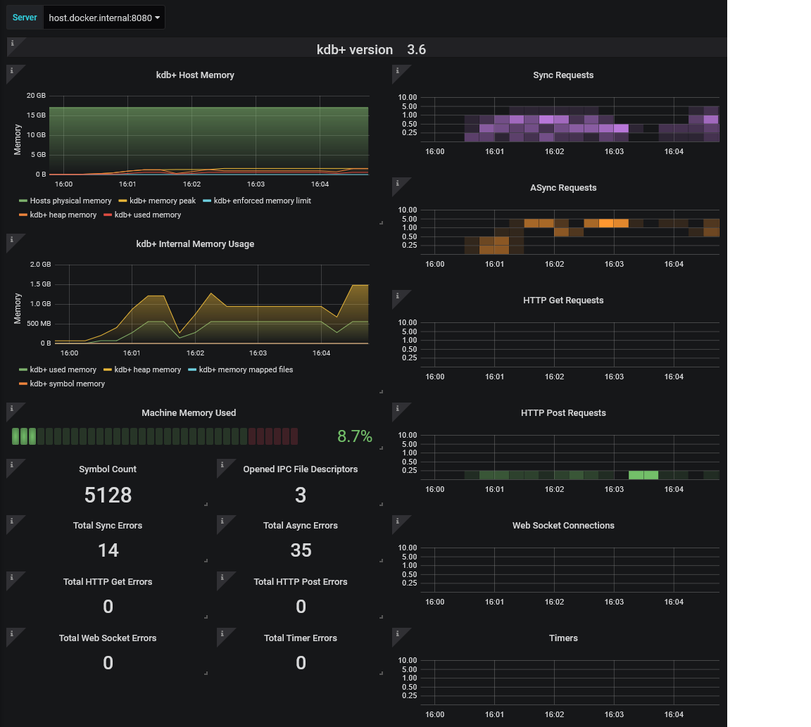

# kdb+ interface for Prometheus-Exporter – example

The demonstration below is described in full [here](../docs/examples.md). 
For clarity, the following is a summary.

## Requirements

This demonstration requires a Docker instance capable of running a Unix-based container e.g. Docker Desktop for Mac/Linux/Windows 19 Pro with internet access.

## Setup

Start a q session locally on port 8080, running `exporter.q` from this folder via the command

```bash
q ../q/exporter.q -p 8080
```

This will expose the metrics associated with this process on port 8080 for consumption by Prometheus.

Initialize a Docker environment containing a pre-configured Prometheus and Grafana setup from within the `DockerCompose` folder via

**Windows/macOS**

Initialize the Docker instance

```bash
docker-compose up
```

When finished running the demonstration stop the process using Ctrl-c or run

```bash
docker-compose down
```

**Linux**

Initialize the Docker instance

```bash
docker-compose -f docker-compose-linux.yml up
```

Run the following when the environment is to be stopped

```bash
docker-compose -f docker-compose-linux.yml down
```

## Example resource utilization

Provided with the interface is the script `kdb_user_example.q`. This can be used to show an example of resources being consumed and monitored using Prometheus. The script will connect to the q session running on port 8080 as outlined above and attempt to use resources in a number of ways

```bash
q kdb_user_example.q
```

## Accessing Prometheus and Grafana

Once the Docker instance has been initialized, Prometheus and Grafana should be running on the following ports

- Prometheus = http://localhost:9090
- Grafana = http://localhost:3000

On the Prometheus front end you can monitor specific metrics as desired. Executing `up` for example will allow a user to check that the exporter is 'up'. If the demo is running correctly this will be 1 for your configured kdb+ instance.

To log into Grafana on port 3000 use the following credentials

- Username = admin
- Password = pass

Once logged in, a pre-configured dashboard named `kdb+` should be available from the _Home_ dropdown. 
This will give an example of monitoring, which can be be completed using the interface but is by no means exhaustive.

The following is an example of a generated dashboard from the above workflow



